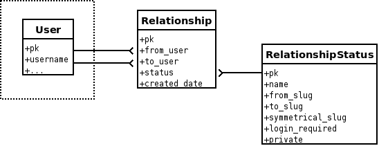

Getting started
===============

The purpose of this doc is to get you up and running quickly.

How the app works
------------------

It doesn't matter too much that the ``User`` model is siloed off, since we're
going to store the ``Relationship`` objects in a separate table:

The only dirty trick is that we create a "fake" ``ManyToMany`` relation and
monkeypatch the ``User`` model with it to expose the relationships using a nice,
familiar API.

Check out `relationships/models.py <https://github.com/coleifer/django-relationships/blob/master/relationships/models.py#L73>`_
for more details.

Models
------

django-relationships attaches a ``ManyToMany`` relationship to the ``User`` model
found in ``django.contrib.auth``.  This is exposed via the `relationships` attribute
on a ``User`` instance::

    >>> john = User.objects.get(username='john')
    >>> rel = john.relationships.add(jane)
    >>> rel
    <Relationship: Relationship from john to jane>

We now have a relationship from "john" to "jane".  The default relationship type
is "following"::

    >>> rel.status
    <RelationshipStatus: Following>

We can query to see who john is following::

    >>> john.relationships.following()
    [<User: jane>]

Or, conversely, see who jane is followed by::

    >>> jane.relationships.followers()
    [<User: john>]

If we want to do a more facebook-like thing by having symmetrical relationships,
that is possible:

    >>> john.relationships.add(bob, symmetrical=True)
    (<Relationship: Relationship from john to bob>,
     <Relationship: Relationship from bob to john>)

Now we can see who john is friends with::

    >>> john.relationships.friends()
    [<User: bob>]

You can also attach a specific "status" to a ``Relationship``, the default being
"following".  There can be any number of statuses -- its totally up to you::

    >>> enemies = RelationshipStatus.objects.create(
            name='enemies',
            verb='enemies with',
            from_slug='enemies-with',
            to_slug='disliked-by',
            symmetrical_slug='mutually-dislike',
        )
    >>> rel = john.relationships.add(joe, enemies)
    >>> rel.status
    <RelationshipStatus: enemies>

We can query a users enemies::

    >>> john.relationships.get_relationships(enemies)
    [<User: joe>]

And also the reverse::

    >>> joe.relationships.get_related_to(enemies)
    [<User: john>]

.. _views:

Views and Templatetags
----------------------

There are a handful of views at your disposal for creating and listing relationships.
This section will assume you've included the relationships urls at /relationships/
in your ``ROOT_URLCONF``::

    urlpatterns = patterns('',
        ...
        url(r'^relationships/', include('relationships.urls)),
        ...
    )

Allowing users to manage relationships
^^^^^^^^^^^^^^^^^^^^^^^^^^^^^^^^^^^^^^

Most likely you'll want your users to be able to follow, unfollow, maybe even
block certain users.

To this end there are a couple views and templatetags that can help you out.

For example, assume you want to display a list of user profiles and give users
the option to:

1. follow the user if they aren't
2. unfollow the user if they're already following them

::

    
    
    
    
      {# decide whether or not the current user is following this user #}
    
      
        
        {# they are following them, so show a "remove" url #}
        <a href="{{ profile.user|remove_relationship_url:"following" }}">Unfollow</a>
    
      
      
        {# they are not following them, so show a link to start following #}
        <a href="{{ profile.user|add_relationship_url:"following" }}">Follow</a>
        
      
    
    
      
This is you!

    

These urls end up taking the following form:

``/relationships/(add|remove)/<username>/<relationship-status-slug>/``

Here are a couple examples:

* ``/relationships/add/joe/following/`` -- start following joe
* ``/relationships/add/bob/friends/`` -- become friends with bob (create symmetrical relationship)

You can generate these urls by hand using the ```` tag, or use the template
filters provided in the ``relationship_tags`` library::

    {{ some_user|add_relationship_url:"friends" }}

The add and remove views support POSTing via Ajax.

Listing relationships for a user
^^^^^^^^^^^^^^^^^^^^^^^^^^^^^^^^

The urls to view a user's relationships take the following form:

``/relationships/<username>/<relationship-status-slug>/``

Here are a couple examples:

* ``/relationships/joe/following/`` -- show who joe is following
* ``/relationships/bob/followers/`` -- see who is following bob
* ``/relationships/joe/friends/`` -- see who joe is friends with

Admin Interface
---------------

Relationships hook right into the pre-existing User admin, and appear below
the 'Groups' inline.

RelationshipStatus and how it works
-----------------------------------

If you look at the model definition for :class:`RelationshipStatus`, it might seem
a little odd as it has 3 separate slug fields:

.. code-block:: python

    class RelationshipStatus(models.Model):
        name = models.CharField(_('name'), max_length=100)
        verb = models.CharField(_('verb'), max_length=100)
        from_slug = models.CharField(_('from slug'), max_length=100,
            help_text=_("Denote the relationship from the user, i.e. 'following'"))
        to_slug = models.CharField(_('to slug'), max_length=100,
            help_text=_("Denote the relationship to the user, i.e. 'followers'"))
        symmetrical_slug = models.CharField(_('symmetrical slug'), max_length=100,
            help_text=_("When a mutual relationship exists, i.e. 'friends'"))
        login_required = models.BooleanField(_('login required'), default=False,
            help_text=_("Users must be logged in to see these relationships"))
        private = models.BooleanField(_('private'), default=False,
            help_text=_("Only the user who owns these relationships can see them"))

Each of these slug fields denotes a particular aspect of the given status.  For
example, if I'm talking about "following" a user these values might be
appopriate:

* from_slug = 'following', as in "these are the people I am following", the relationship comes *from* me
* to_slug = 'followers', as in "these are my followers", they have a relationship *to* me
* symmetrical_slug = 'friends', as in "we are friends, we follow each other"

The relationship views use these slugs to tell what kind of relationships you want
to present, so going to ``/relationships/charles/following/`` will show a list of
people "charles" is following, whereas ``/relationships/charles/friends/`` will show
a list of people with whom charles has a symmetrical following relationship.

You can have any number of :class:`RelationshipStatus` instances, but by default
the app comes with two:

* Following
* Blocking

Filtering content
-----------------

There is very little use for social features on a site unless you're doing some kind of filtering based on a logged-in user's relationships.  For example, if Paul is blocking Yoko, he probably doesn't want to see her latest posts.

`django-relationships <http://github.com/coleifer/django-relationships/>`_ offers several features to make filtering content easier.

Template filters
^^^^^^^^^^^^^^^^

there are several high-level template filters for your content.  assume we're dealing with a photo sharing site that has social features.

.. code-block:: python
    
    {# all examples use relationship_tags #}
    

Assume you have a generic view that is returning a list of photos.  It is very easy to filter incoming content

.. code-block:: python

    <h3>Friends' photos</h3>
    
      ... only stuff from my friends ...
    
    
    <h3>Following photos</h3>
    
      ... only stuff from the people I follow ...
    
    
    <h3>Follower's photos</h3>
    
      ... only stuff from people who follow me ...
    

If you want, there's also a filter for any status but blocked.  Cumulatively, these simple filters show how you can white/black-list of content based on a user's relationships.

.. code-block:: python
    
    <h3>Photos</h3>
    
      ... stuff from everyone but the people I have bloocked ...
    

lower-level filtering
---------------------

relationships.utils has two helper functions that can be used to white/black-list content from various users.

.. py:function:: positive_filter(qs, user_qs[, user_lookup=None])

    apply a white-list to a queryset of content, only allowing through items by users in the user_qs

    :param qs: queryset of content items to be filtered
    :param user_qs: queryset of users whose content should be allowed through
    :param user_lookup: the lookup on the content model for the user field to use when filtering - it will be autodetected if not supplied

.. py:function:: negative_filter(qs, user_qs[, user_lookup=None])
    
    apply a black-list to a queryset of content, allowing through items *NOT* by users in the user_qs

    :param qs: queryset of content items to be filtered
    :param user_qs: queryset of users whose content should *NOT* be allowed through
    :param user_lookup: the lookup on the content model for the user field to use when filtering - it will be autodetected if not supplied

Example
^^^^^^^

.. code-block:: python

    photo_qs = Photo.objects.all()
    user_friends = request.user.relationships.friends()
    user_blocked = request.user.relationships.blocking()
    
    # assume the photographer is a FK to User
    friend_photos = positive_filter(photo_qs, user_friends, 'photographer')
    non_blocked_photos = negative_filter(photo_qs, user_friends, 'photographer')

    # now friend_photos contains only photos by the requesting users friends
    # and non_blocked_photos contains photos by anyone the request user has not blocked
